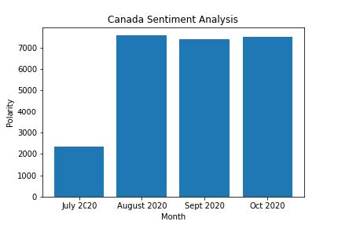
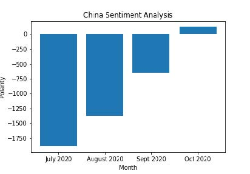
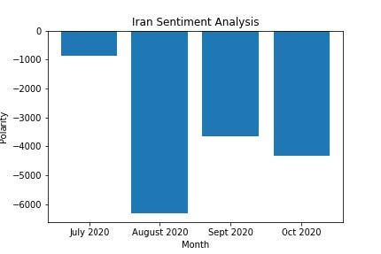
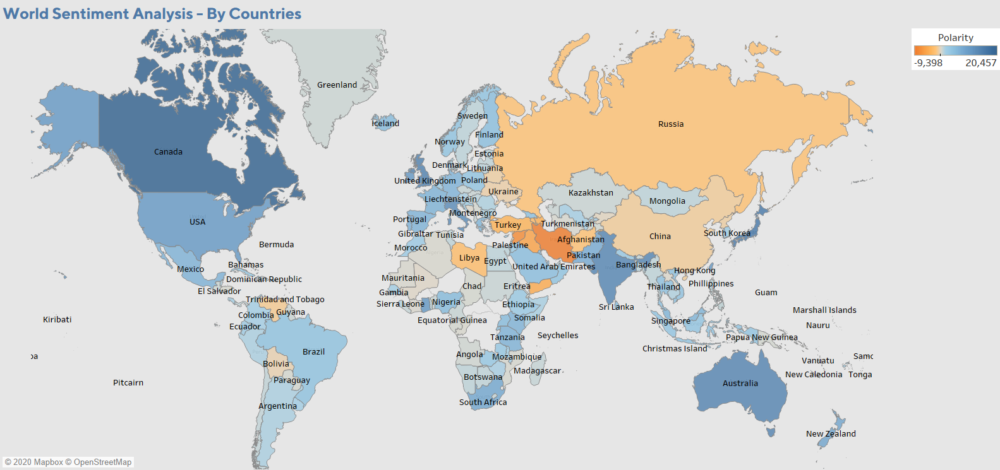
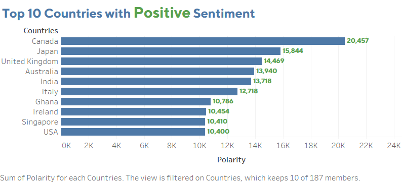
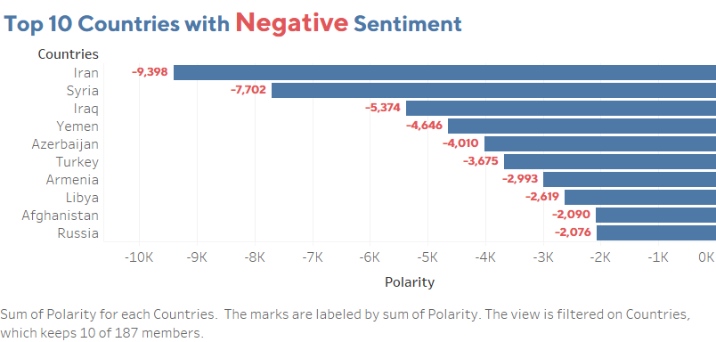

# World sentiment analysis by countries using Twitter data

## Abstract
With over 320 million monthly active users, Twitter continues to be a rich and vast resource for data on the Web. It’s more than enough to understand the sentiment of the world regarding something. Here we will be looking at the general sentiment of the world for the countries with the data like tweets, user search queries and the number of retweets(popularity). These metrics helps to create a polarity score to determine the sentiment of a certain country. Also, we have created visualizations based on this score analyzing the trends and the polarity spectrum.

## Data Collection
The data is provided in the CSV format from [Kaggle](https://www.kaggle.com/wjia26/twittersentimentbycountry) (World - Twitter Sentiment By Country)
According to me, two of the main aspects of big data (Velocity and Volume) are present in my data in the following ways:
The Twitter World Sentiment dataset takes over 2.18 GB of storage of texts, links, and numbers. The dataset contains 4 tables of the four months July, August, September, and October of the year 2020. There is a total of 1242243 rows, 2677529 rows, 1411426 rows, and 1301271 rows in the tables respectively. This satisfies the Volume criteria.
Also, the dataset is updated with the data of the previous month, every month by the data owner, hence it has velocity. 

## Data Cleaning and Processing
***What did you need to do to prepare the dataset(s) to create your graph/chart?***
After I collected the data, it was present in 4 tables according to the months. The dataset had a lot of null entries which were causing an issue for plotting the charts. I cleaned the dataset: removed all the null entries from the location column, combined the four CSV files into a single file, and grouped them by the month.

***How did you choose the attributes and data subset to visualize?***
The dataset consisted of the following attributes: created_at, file_name, followers, friends, group_name, location, retweet_count, screen name, search_query, text, twitter_id, username, polarity, partition_0, partition_1. A lot of the attributes were not needed for the visualization. The final data used for the exploration and visualization is as follows
* The Country can be derived from the **group_name** field.
* The Date at which the tweet was created can be got from the **created_at** field.
* The Search Query used to query the Twitter Search Engine can be got from the **search_query** field.
* The Tweet Full Text can be got from the **text** field.
* The Sentiment can be got from the **polarity** field.

## Data Exploration
For exploration, I thought of checking the data by country. I checked the sentiment for China as it was in a bad light in 2020 due to the pandemic. We can see a gradual increase in the sentiment score as we move to the end of 2020.

Similarly, here is the sentiment score analysis for Canada and Iran as they are the most positive and negative countries sentiment-wise.

 
     

## Data Visualization

### Choice of Chart type

Chart 1 is a map chart that shows the world map with all the countries highlighted according to their polarity as shown in the legend. Charts 2 and 3 are the top 10 countries with positive and negative sentiments in the world according to the tweets respectively.

According to me, a colored map chart would be best to determine the range of polarity for all the countries in the world. Also, I wanted to highlight the top countries concerning their positive and negative polarity score.

### Design Choices
Referring the [3] blog post, I made the following changes to the map chart:
- Changed a single colour(light/dark) for showing the polarity range to a multi-color diverging option which made the chart look more informative.
- Removed background noises in the map chart such as unlisted countries, unnecessary boundaries.
- Lightened the boundary colors for making a decent color scheme for the map.
Used colors like red and green to depict the negative and positive numbers for the top 10 countries for sentiment analysis.

### Tools and libraries
Python was used for all the data cleaning and processing. The pandas library was used for processing the data from the CSV file.
Tableau and matplotlib library were used for all the data exploration and creating graphs and charts.

## Conclusion
The most difficult part was to create the map chart and make it seem visually easy to get information without creating a clutter. The data was skewed and not clean. Cleaning and pre-processing weren’t a tedious task though. The choice of graphs and charts took a lot of time.
For the Top 10 bar charts, I wanted to add add another colour to distinguish between the top rankings in positive sentiment countries (e.g Top 3) and in negative countries (Top 3) without it making the chart distracting for having too much information at the same time. I wanted to add different graphs other than just bar graphs and map charts. I have also created an interactive dashboard.

## References
[1] [Twitter Sentiment by Country Dataset](https://www.kaggle.com/wjia26/twittersentimentbycountry)

[2] For data exploration and bar charts, matplotlib was used with the reference to 
https://towardsdatascience.com/data-visualization-using-matplotlib-16f1aae5ce70

[3] For designing and creating a map chart, I referred to 
https://www.tableau.com/learn/articles/interactive-map-and-data-visualization-examples

[4] Designing better charts and dashboards using
 https://help.tableau.com/current/pro/desktop/en-us/dashboards_best_practices.htm